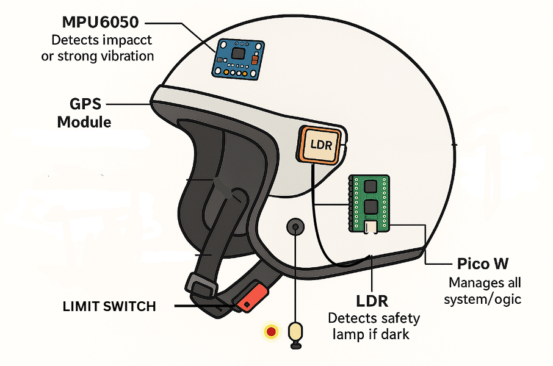
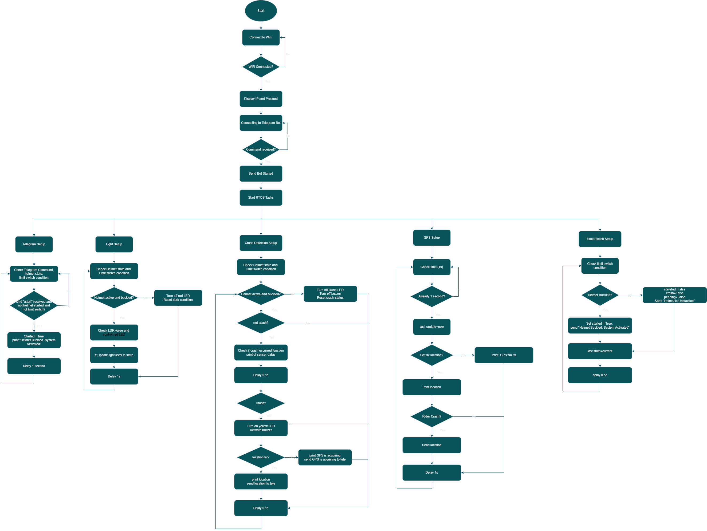
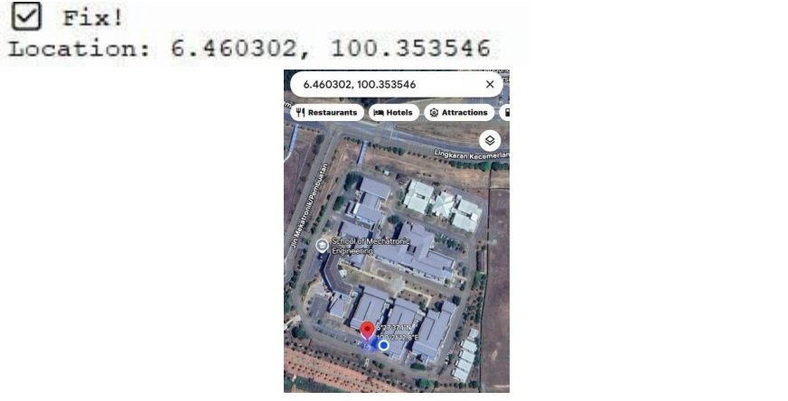

# ResQ Helmet

A smart helmet safety system developed using Raspberry Pi Pico W and CircuitPython to enhance rider safety through real-time monitoring, crash detection, location tracking, and emergency alert functions.

## Project Overview

ResQ Helmet is designed to improve rider safety by detecting potential accidents and automatically sending emergency notifications through Telegram. The system integrates multiple sensors to monitor crash events, helmet usage status, and ambient lighting conditions while providing real-time location information for emergency response.

## Key Features

* Crash detection using MPU6050 accelerometer and gyroscope
* Automatic Telegram SOS notification
* GPS location tracking
* Ambient light monitoring
* Buzzer warning system
* Helmet usage detection using limit switch
* Real-time sensor monitoring

## Hardware Components

| Component           | Function                                   |
| ------------------- | ------------------------------------------ |
| Raspberry Pi Pico W | Main controller and wireless communication |
| MPU6050             | Crash and motion detection                 |
| GPS Module          | Real-time location tracking                |
| LDR Sensor          | Ambient light monitoring                   |
| Buzzer              | Audible warning and alert indication       |
| Limit Switch        | Helmet usage detection                     |

## Software & Technologies

* CircuitPython
* Telegram Bot API
* Embedded Systems
* IoT Applications
* Sensor Integration

---

# System Overview

The following diagram illustrates the overall architecture of the ResQ Helmet system and the interaction between the sensors, controller, and safety functions.

The Raspberry Pi Pico W serves as the main controller, processing sensor data from the MPU6050, GPS module, LDR sensor, and limit switch. Based on the detected conditions, the system can activate alerts, retrieve location information, and send emergency notifications.

---

# System Flow

The system flow diagram illustrates the operational sequence of the ResQ Helmet from sensor monitoring to emergency response.

The system continuously monitors motion, impact levels, ambient lighting conditions, and helmet usage. When a crash is detected, the system automatically retrieves GPS coordinates and sends an SOS notification through Telegram to facilitate a faster emergency response.

---

# Hardware Configuration

The image below shows the actual hardware implementation and integration of the sensors, controller, and communication modules used in the project.

The prototype integrates the Raspberry Pi Pico W, MPU6050 sensor, GPS module, LDR sensor, buzzer, and limit switch to form a complete embedded safety monitoring system.

---

# Prototype

The completed ResQ Helmet prototype demonstrating the integration of hardware components into the helmet structure.

This prototype serves as the proof-of-concept for implementing intelligent safety features in motorcycle helmets through embedded systems and IoT technologies.

---

# Wiring Diagram

The wiring diagram illustrates the electrical connections between the Raspberry Pi Pico W and the integrated sensors and peripherals.

This diagram was used during system development, integration, and troubleshooting to ensure proper communication between hardware components.

---

# Emergency Location Tracking

In the event of a crash, the system automatically retrieves GPS coordinates and provides location information to support emergency response activities.

The location data can be viewed directly through Google Maps, enabling responders or emergency contacts to quickly identify the rider's location.

---

# Telegram SOS Notification

When a crash event is detected, the system automatically sends an emergency alert through Telegram.

The notification includes emergency information and location details, allowing designated contacts to receive alerts in real time.

---

# Demonstration Video

Watch the project demonstration here:

[Project Demo Video](https://youtu.be/T02Tgaeat9Q?si=MFx0AoZFtniPDixu)

---

# Skills Demonstrated

* Embedded Systems Development
* Sensor Integration
* IoT Applications
* Hardware Troubleshooting
* Real-Time Monitoring Systems
* Safety System Design
* GPS Tracking Systems
* Wireless Communication
* CircuitPython Programming

---

# Note

The source code is kept private. This repository is intended to showcase the project architecture, implementation, and outcomes for portfolio purposes.

---

# Author

**Muhammad Iqbal Bin Izan**

Bachelor of Mechatronic Engineering with Honours

Universiti Malaysia Perlis (UniMAP)
