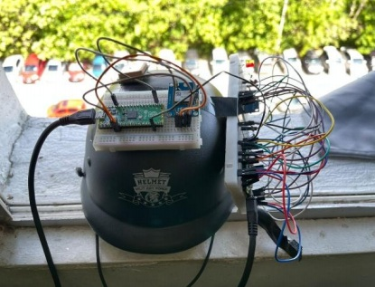
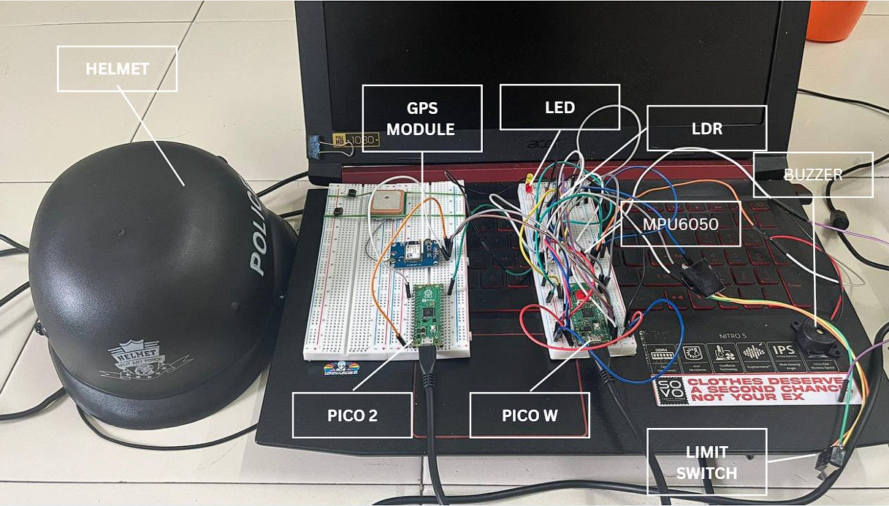
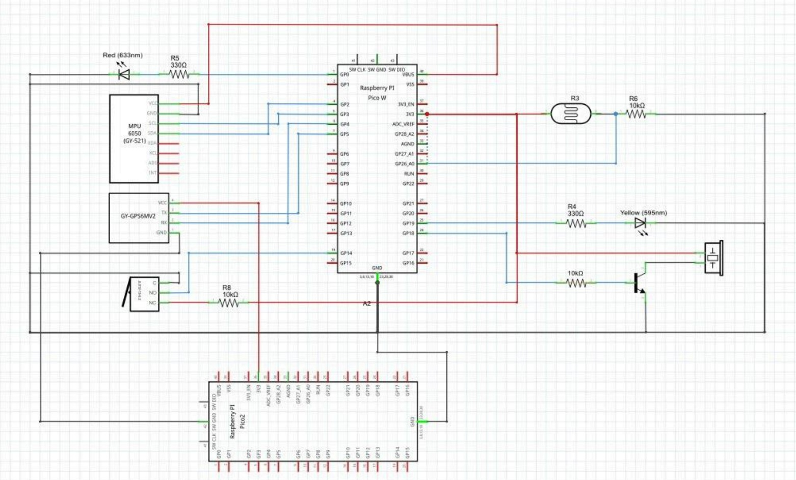
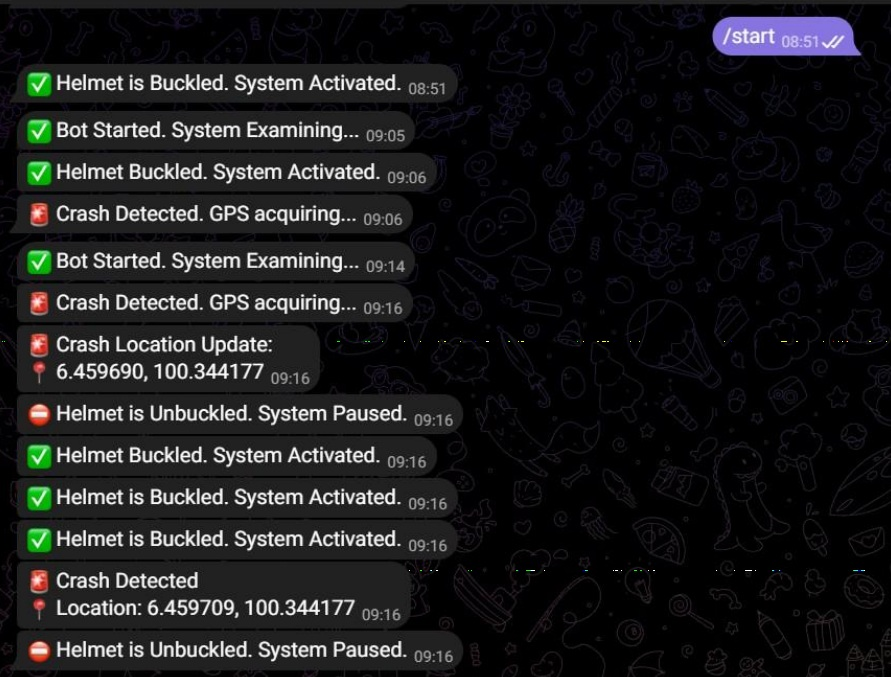

# ResQ Helmet

A smart helmet safety system developed using Raspberry Pi Pico W and CircuitPython to enhance rider safety through real-time monitoring and emergency alert functions.

## Project Overview

ResQ Helmet is designed to improve rider safety by detecting potential accidents and automatically sending emergency notifications through Telegram. The system also monitors ambient lighting conditions and helmet usage status to support safer riding practices.

## Key Features

- Crash detection using MPU6050 accelerometer and gyroscope
- Automatic Telegram SOS notification
- Ambient light monitoring
- Buzzer warning system
- Helmet usage detection using limit switch
- Real-time sensor monitoring

## Hardware Components

- Raspberry Pi Pico W
- MPU6050
- LDR Sensor
- Buzzer
- Limit Switch

## Software & Technologies

- CircuitPython
- Telegram Bot API
- Embedded Systems
- IoT Applications
- Sensor Integration

## System Architecture

## Project Images

### Final Prototype

### Hardware Setup

### Wiring Diagram

### GPS Location

### Telegram SOS Notification

## Demonstration Video

Watch the project demonstration here:

[Project Demo Video](PASTE_YOUR_VIDEO_LINK_HERE)

## Skills Demonstrated

- Embedded Systems Development
- Sensor Integration
- IoT Applications
- Hardware Troubleshooting
- Real-Time Monitoring Systems
- Safety System Design

## Note

The source code is kept private. This repository is intended to showcase the project architecture, implementation, and outcomes for portfolio purposes.

## Author

**Muhammad Iqbal Bin Izan**

Bachelor of Mechatronic Engineering with Honours

Universiti Malaysia Perlis (UniMAP)
